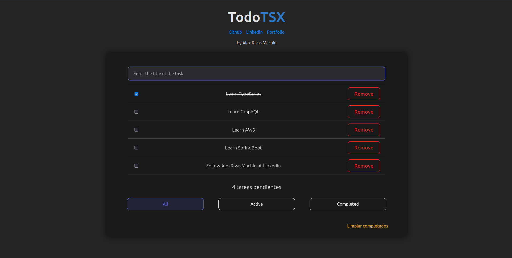

# TodoTSX with TypeScript and React

WepApp that allows you to add, delete and mark todos as done. It is built with TypeScript and React.

## Technologies 🧰
- TypeScript 🟦
- React ⚛️
- Node.js 🟩
- EsLint ✍️

## Features 📋
- Add a new todo 🆕
- Delete a todo ❌
- Mark a todo as done :white_check_mark:
- Filter todos by status 🤩

## Project structure 📁
+ App.tsc - Main component
+ Todos.tsx - List of todos
+ Todo.tsx - Todo component
+ CreateTodo.tsx - Form to create a new todo
+ FilterTodos.tsx - Filter todos by status

## Types and Consts 📝
### at types.ts
+ Todo - Interface for a todo
+ FilterValue - typeof TODO_FILTER
### At CONSTS.ts
+ TODO_FILTER - as Const  in order to not mutate the code
+ FILTER_BUTTONS - Array of FilterValue

## How to run the project 🚀
1. Clone the repository
2. Run `npm install`
3. Run `npm run dev`

## How to build the project 🛠
1. Run `npm run build`

## Links 🔗
- [GitHub](https://github.com/AlexRivasMachin)
- [Portfolio](https://www.linkedin.com/in/alex-rivas-machin/)
- [LinkedIn](https://alexdev.eus/)
